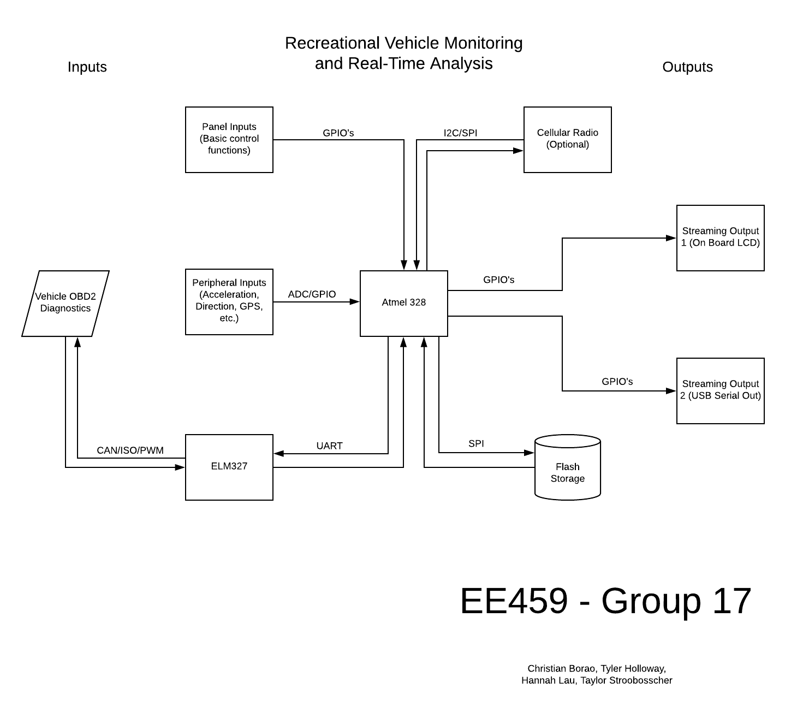

# EE459Spring2019
Group 17 code

# Recreational Vehicle Monitoring and Real-Time Data Analysis

## Abstract

Our project involves reading the standardized diagnostic information 
broadcasted by all vehicles homologated for sale in the US after 2007,
capturing live positional and geographical data, and presenting the aggregated
data as a performance branded vehicle enhancement. This system will effectively
give an end user access to professional grade vehicle performance monitoring 
equipment in a single, complete package.

## Purpose

Our intention is to record readily available diagnostic information 
combined with sensory data such as location and acceleration to a vehicle
enthusiast and recreational racing participant for monitoring and analyis 
purposes. With this system, users will be able to identify driving
characteristics that can produce real-time and logged data that can then be
carefully analyzed to optimize for any driving condition. With sensory data
this generic, it would also be able to monitor driving conditions that can
lead to safety hazards, premature vehicle and engine wear, and provide 
immediate and specific maintenence notifications (ex. your check engine light
goes on, what caused it?). 

## Usage

This system will function as a standalone unit that interfaces with the 
vehicle's 16 pin OBD2 port underneith the dash, and can then be mounted to the
center console where a display and button panel can provide controls and
streaming output to the user. Since the OBD2 standard provides 12V DC power, 
our only connection once inside the vehicle will be to the same diagnostic 
port. The user can configure and select data streams and choose when to enable
logging for later analysis. The log files can then be offloaded and then parsed
with custom software.

## Major Pieces
	
Firstly Our system is modularized around the ATMEGA328 processor. The 
processor will handle all input, asynchronous and synchronous, as well as
output streaming to any peripheral displays, serial ports, or memory units. All
vehicle communication is facilitated with the diagnostic module, employing the 
ELM327L. This chip provides multiple interfacing options for vehicle analysis 
and can read a wide range of makes, models, and years of vehicles. The 
diagnostic module has a built in UART interface and will meet the ATMEGA328's
UART immediately. No logic translation is needed since the ELM327 can be 
configured to run 5V logic. Next, any control modules such as buttons or 
controls can be routed to GPIO's on the main processor. Any peripheral sensory
units have the option of interfacing with the processor though digital logic,
or we can use one of the on-board ADC's that comes with the 328. On the output
side, the processed data will mainly be sent syncronously to the various memory
or streaming devices. SD Flash uses its own co-processor and data is typically 
exchanged over an SPI connection although some logic translation may be 
necessarry. A board-mounted LCD will provide control interfacing and data
streaming that can interface with the 328 using an array of GPIO's. Lastly, 
a generic serial communication output can provide us the option to mount our
device to an external machine and provide a high level of abstraction for a
more complex software implementation of real-time data analysis and 
presentation (ex. sending our data stream to an android tablet that can display
a much more complex array of data and control abilities).

## Makefile/Compiler

The compiler flags were set up to target the ISP programmer from a linux machine
so it might not work on other systems. For some reason the USBtiny doesn't 
enumerate a tty device, the avr toolchain interfaces with it through the usb bus 
infrastructure with the VID:PID numbers. The programmer still works but its a
little different than the 328.

C compiler set to C99
```
	-std=c99
```

## Pins

Pin definitions are set in the pin structure of the pins.c file. The structure 
maps the physical pin numbers to their individual registers. So instead of 
manually bit shifting into the PORTX reg's, we can spend a few extra bytes of
code to abstract the bit level writing. Now, all we do to write to a pin is:
```
	assert_pin([physical pin number])
	deassert_pin([physical pin number])
```
Note, any argument of an invalid pin type (The arg number is out of range or
addresses an invalid pin or addresses and input pin will cause the function to
return -1, indicating a failure, and no action will be performed)

Also, the register assignments in that file should remail the same, but we should
absolutely change the default data direction at some point. Right now they are
all configured to output. To switch just write:
```
	struct {
	...
	#,	PORT_REG, #, ATMEL_OUTPUT/ATMEL_INPUT, PULL_UP/DN
	...
	}
```

And somewhat confusingly, in the pins header file, there are another set of
definitions for the physical pins. This just defines Macros to use instead of
actual integer numbers for spcific pin operations. I try as hard as possible
to avoid unitless and dimensionless "magic numbers" in any programming
language. It just ends up being confusing later on. But to reiterate, the
structure definition in pins.c defines the actual memory allocation and pin
behavior that the board will initialize itself with

## I/O
Since our application is critical in real-time, we should optimize our
design for bandwidth. This consideration would suggest using the built-in SPI
interface on the ATMEL chip, since it is the fastest I/O structure we have.

If we invest some engineering time into developing the SPI interface, we will
be able to amortize its cost over the breadth of the various I/O devices we
have planned. This involves planning on integrating hardware that is SPI ready.
This will be able to handle a large number of complex I/O devices with marginal
cost (1 extra pin per device).

With this in mind, we might be able to rethink some of the architecture. For
example, we should dedicate the ATMEL Uart to monitor I/O or RS232, and use
a peripheral spi-uart(
<a href="https://www.mouser.com/ProductDetail/Maxim-Integrated/
MAX3100CPD%2b?qs=sGAEpiMZZMvslxq79%2fS5eSKNqE2Bo8gitsmTeCTA4pw%3d">
MAX3100</a> ) for ELM327 communication since it only runs at like 34.8Kbps.

This will leave room for input device development, as the major components will
apready be handled by the same hardware and software.	

## Modules

### Flash Storage
This will probably incorporate some peripheral ICs to facilitate some flavor
of multiplexed IO (SPI, I2C, UART) 

Will need to research the requirements and design this module

SD cards use SPI, integrating SPI will eat up 4 pins:
<ul>
	<li>MOSI
	<li>MISO
	<li>CLK
	<li>CS
</ul>

We will need a carriage for the card (
<a href="https://www.mouser.com/ProductDetail/SparkFun/
BOB-00544?qs=WyAARYrbSnZK7N50UQw0UQ%3D%3D&gclid=EAIaIQobChMI4KPcy5a84AIVjyCtBh33MgsvEAQYAyABEgJzLvD_BwE">
SD_CARD_HOLDER
</a> ), and then some resistors and capacitors
to keep us from breaking the card. Decoupling capacitors: 0.1uF, and then
current limiting resistors. Ask Weber for advice. Also, we need to level shift
between 5 and 3.3, with high frequency response (SPI is in the MHz range)

I found a good website that explains FAT and SPI interfacing from the atmel to
an SD card <a href="http://codeandlife.com/2012/04/02/simple-fat-and-sd-tutorial-part-1/">
here </a>

FAT32 code design and resoureces: <a href="https://www.pjrc.com/tech/8051/ide/fat32.html">
PJRC FAT32 Walkthrough</a>

So the FAT32 system is mostely mapped out in the test directory. Partitions are
found at the MBR, the boot sector is read and the data is setup for the file
system. The files are mounted at the root directory, and are laid on top of the
cluster sector. The clusters are tracked in the FAT data structure.

Writing a file:<ul>
	<li>Initialize file system, read MBR, Boot Sector, check for FAT32 LBA
	<li>Traverse the FAT and find the next open cluster, return if fulls
	<li>Write directory entry, write data to cluster
	<li>update directory entry
</ul>

### Serial Stream
This will need to stream realtime data over a serial interface that we can
use for both data projection (like on a screen or something) and debugging.
The 328 boards come with UART support, but we will need at least 2 UART
modules to balance between input and command processing on the 327 and
streaming output. 
Once this module is in place, extending some kind of complex interface over
this data stream should be pretty straightforward (Bluetooth, Wi-Fi, etc)

If we dont need to handle serial input asynchronously, then it would be 
possible to multiplex the uart hardware, but it might be a good idea to invest
the time now so we have that flexibility later on.

Ideally, we could extend the SPI interface used for the flash module and with
only one more pin we could add another UART interface that would be able to
support full, asynchronous duplex communication

SPI/I2C UART Extender: 
<a href="https://www.mouser.com/ProductDetail/Maxim-Integrated/MAX3100CPD%2b?qs=sGAEpiMZZMvslxq79%2fS5eSKNqE2Bo8gitsmTeCTA4pw%3d">
MAX3100</a>


### LCD
We are looking at different LCD layouts to find the correct option with regards
to out hardware and software constraints. The boards can be configured a number
of ways:<ul>
	<li>Half byte with control, 3 control pins, 4 data pins - 7 total
	<li>Full byte with control, 3 control pins, 8 data pins - 7 total
	<li>Serial?/SPI?
</ul>

### ECU Communication (Hardware and Software)
We have the broadstrokes of this one laid out. The ELM327 documentation comes
with more than enough information to lay out a complete circuit. This part just
needs the parts ordered, the connections routed, and the software written.

Luckily, we have an assembled 327 circuit that we can start to use for software
development in parallel to hardware development. Thus, this module can be 
broken up into 2 submodules, the hardware and the software.

This module follows a request, response architecture, so data is handled 
synchronously

EDIT: The ELM pin assignments might be changing

UART - 2 pins

### Extra Sensory Information
Here we can leverage the 328s on board ADC and input support to maximize our
data collection. What else could we add? GPS? Temp? Acceleration? Magnometry?
What would our wish list for peripheral sensory input look like?

### RTOS Optimization
Since many of these I/O devices have varying amounts of latency and bandwidth
requirements (A write operation to the flash can be stalled to process a read
operation from the ELM327), it may be useful to implement some kind of
scheduling mechanism to ensure a balanced and flexible distribution of I/O and
CPU resources.

EDIT:
We can emulate this functionality with the various hardware interrupts the 328
supports:<ul>
	<li>INT0_vect		: Generic external
	<li>INT1_vect		: Generic external
	<li>PCINT0_vect		: Pin change PORTB
	<li>PCINT1_vect		: Pin change PORTC
	<li>PCINT2_vect		: Pin change PORTD
	<li>SPI_STC_vect	: SPI transfer complete
	<li>USART_RX_vect	: UART RX complete
	<li>USART_UDRE_vect	: UART data register empty
	<li>USART_TX_vect	: UART TX complete
	<li>ADC_vect		: ADC conversion complete
	<li>TWI_vect		: I2C? Might be useful
	<li>and all the various timer interrupts
</ul>
I have no idea what this would entail, but it wouldn't hurt to do some research
on the topic to see if there are any open source libraries that we could 
possibly take inspiration from.

# Draft of our Block Diagram



## Useful Commands

### Creating a snapshot of the repo
```
	git archive -o snapshot.zip --format zip HEAD
```
### Cloning repository
This creates a local repository identical to the remote one that you can test
with and make changes to.
You can grab the git URL from the "Clone or Download" tab on the repository 
front page
```
	git clone <http-url-git>
```
### Viewing repository changes, both staged and unstaged
```
	git status
```
### Adding changed files to the commit stage
Once you're comfortable with your changes you can mark then for addition to the
repository's database. To add all changed files you can substitute the path
argument with "." and execute from the project root.
```
	git add <path/to/file>
```
### Commiting changes
Once the changes you make are finalized and added to the commitment stage they
can be added to the permanent history of the repository.
```
	git commit -m "commit message, Hello!"
```
### Branching off on a working branch
Typically you don't just make changes directly to the same branch every one
else is working on. This can lead to data races and ends up being pretty
annoying to work out once code gets mixed up. So generally you branch off onto
your own section separate from everyone else, work there, and then merge in all
your changes to the master all in one motion.
```
	git checkout -b New-Branch-Name
```
### Synchronizing your local repository with the remote
This just pulls in other peoples changes into your own local repository.
```
	git pull
```

## Stats
| Date | Commit | Program Space | Data Space |
|---|---|---|---|
| February 3, 2019 | 1a580e57 | 3.2% | 7.1% |
| February 14, 2019 | 2ff6edde | 3.6% | 8.1% |
| February 19, 2019 | a9bf3ceb | 3.6% | 35.4% |
| February 19, 2019 | ea79e88a | 9.5% | 42.9% |
| February 21, 2019 | d37c9837 | 10.1% | 42.9% |
| February 21, 2019 | f63b8958 | 11.2% | 43.1% |

## Issues
Programming the board while using SPI devices can cause bus contention and can
interfere with the actual binary uploading. The ISP should have a lock on the 
SPI bus, all other devices should be held at high impedance. Tri-state buffer?